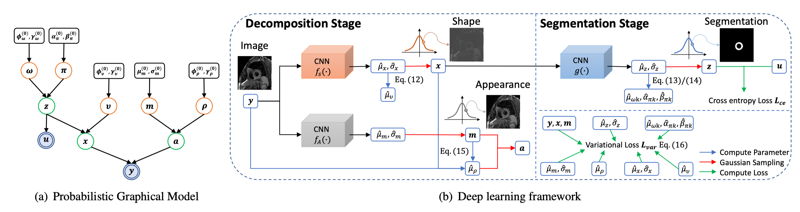

# BayeSeg: Bayesian Modelling for Medical Image Segmentation with Interpretable Generalizability

Welcome👋! This repository provides the official implementation of our paper *BayeSeg: Bayesian Modelling for Medical Image Segmentation with Interpretable Generalizability* [[MedIA](https://www.sciencedirect.com/science/article/pii/S1361841523001494)] [[arXiv](https://arxiv.org/abs/2303.01710)], which has been accepted by *Medical Image Analysis*.




## 🔍 Details
> Due to the cross-domain distribution shift aroused from diverse medical imaging systems, many deep learning segmentation methods fail to perform well on unseen data, which limits their real-world applicability. Recent works have shown the benefits of extracting domain-invariant representations on domain generalization. However, the interpretability of domain-invariant features remains a great challenge. To address this problem, we propose an interpretable Bayesian framework (BayeSeg) through Bayesian modeling of image and label statistics to enhance model generalizability for medical image segmentation. Specifically, we first decompose an image into a spatial-correlated variable and a spatial-variant variable, assigning hierarchical Bayesian priors to explicitly force them to model the domain-stable shape and domain-specific appearance information respectively. Then, we model the segmentation as a locally smooth variable only related to the shape. Finally, we develop a variational Bayesian framework to infer the posterior distributions of these explainable variables. The framework is implemented with neural networks, and thus is referred to as deep Bayesian segmentation. Quantitative and qualitative experimental results on prostate segmentation and cardiac segmentation tasks have shown the effectiveness of our proposed method. Moreover, we investigated the interpretability of BayeSeg by explaining the posteriors and analyzed certain factors that affect the generalization ability through further ablation studies.


## 📦 Get started

### Installation
1. Create a virtual environment `conda create -n BayeSeg python=3.10` and activate it `conda activate BayeSeg`
2. Install [PyTorch](https://pytorch.org/get-started/locally/)
3. `git clone https://github.com/obiyoag/BayeSeg`
4. Enter the BayeSeg folder `cd BayeSeg` and run `pip install -r requirements.txt`

### Data preparation
- The prostate dataset can be downloaded from [here](https://liuquande.github.io/SAML/).
- We trained on site RUNMC, which is splitted as
    ```
    RUNMC
    |-- test: [00, 08, 11, 16, 24, 28]
    |-- train: [01, 02, 03, 04, 06, 07, 09, 12, 13, 14, 15, 17, 18, 19, 20, 22, 23, 25, 26, 27, 29]
    `-- val: [05, 10, 21]
    ```


### Training
```shell
python train.py --output_dir logs/BayeSeg --dataset_dir /path/to/dataset
```

### Testing
```shell
python test.py --checkpoint_dir logs/BayeSeg --dataset_dir /path/to/dataset
```

### Download Model
The trained model can be found [here](https://drive.google.com/file/d/1PLh50RXBjc8CdPKuutrYAtvkKa1SVUxj/view?usp=sharing) and should be placed at `logs/BayeSeg/best_checkpoint.pth`.

## 📒 To do
- [x] Prostate code release
- [x] Prostate model release
- [ ] Cardiac code release
- [ ] Cardiac model release
- [ ] Tutorial


## 🙋‍♀️ Feedback and Contact
- shqgao@163.com
- zxh@fudan.edu.cn


## 🛡️ License

This project is under the Apache-2.0 license. See [LICENSE](LICENSE) for details.

## 🙏 Acknowledgement

- We appreciate [monai](https://github.com/Project-MONAI/MONAI) for developing the open-source deep learning framework for medical images.
- We thank Quande Liu for summarizing the multi-site prostate dataset.

## 📝 Citation

If our work is helpful in your research, please cite this as follows.
```
@article{Gao2023BayeSeg,
    author={Shangqi Gao, Hangqi Zhou, Yibo Gao, Xiahai Zhuang},
    title={BayeSeg: Bayesian Modelling for Medical Image Segmentation with Interpretable Generalizability},
    journal={Medical Image Analysis},
    year={2023}
}

@article{Gao2022BayeSeg,
    author={Shangqi Gao, Hangqi Zhou, Yibo Gao, Xiahai Zhuang},
    title={Joint Modeling of Image and Label Statistics for Enhancing Model Generalizability of Medical Image Segmentation},
    article={International Conference on Medical Image Computing and Computer Assisted Intervention},
    year={2022}
}
```
